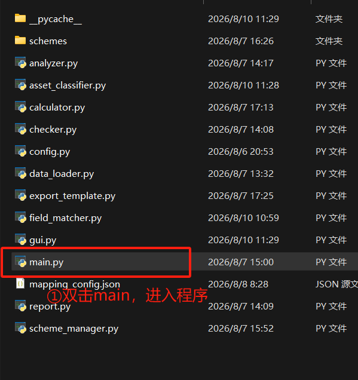
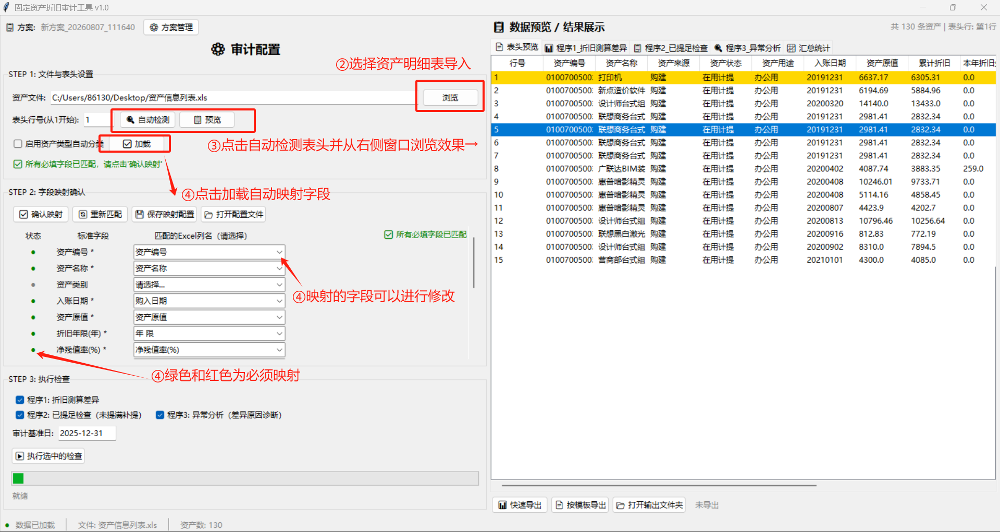
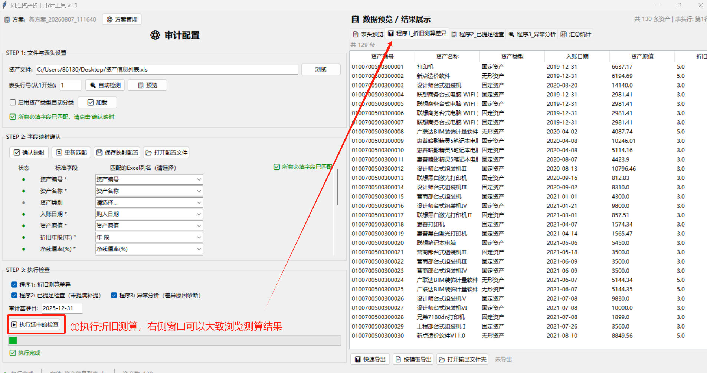
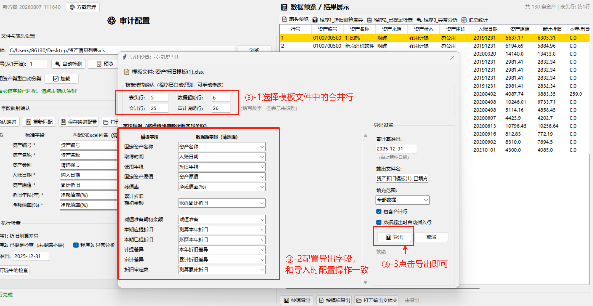
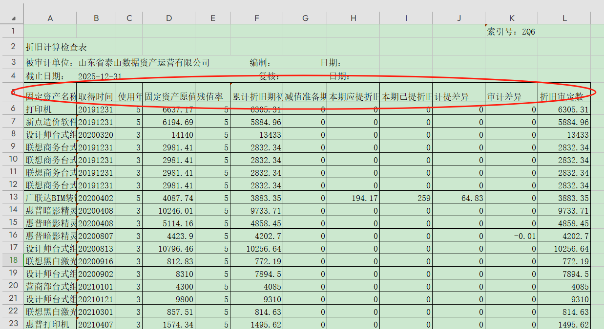

# 资产折旧测算核查工具

导入被审计单位导出的资产明细表，执行测算并按照模板（底稿模板）填充输出底稿。

## 主要功能

- 资产折旧测算检查
- 按照模板文件导出测算底稿

## 环境要求

- 暂无

## 使用步骤

### 1. 导入资产明细表并配置数据

①双击“main”入口打开本程序；

②选择从企业资产系统中导出的明细表（表头可以不改，后面可以进行设置数据开始行）；
③配置标后行，点击自动检测程序自动识别表头行，右侧区域可以浏览，黄色行为第一数据行；
④字段映射：标准字段是程序进行测算所需要的数据，右侧选择对应的列数据作为该字段映射，可以自行选择（支持滚轮上下选择）。

### 2. 测算执行与导出

①点击“执行选中的检查”按钮即可执行测算，右侧区域可以浏览测算结果；
②导出测算结果，导出模式有两种：快速导出、按模板导出 。快速导出是按照右侧浏览窗口的格式直接导出，格式较为混乱，**推荐使用按模板导出**，配置列字段后即可按照底稿模板输出。

③按按模板导出配置，点击“按模板导出”后选择模板文件弹出配置窗口；
③-1选择表头、审计说明这些合并行，程序会在这些合并行中间自动加行；
③-2配置导出数据字段映射选择数据与模板列对应，和前面的导入字段映射原理一致；

③-3打击“导出”选择导出位置后即可获得按照模板填充的测算表格。

